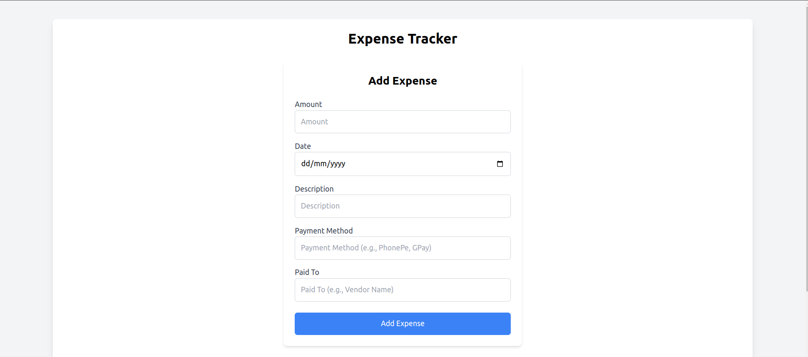
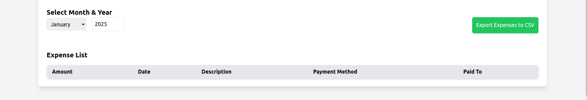

# Expense Tracker

## Description

Expense Tracker is a web application for tracking and managing your expenses. Built with Laravel for the backend (PHP), and React for the frontend, this application allows users to store, filter, and export expenses. It includes features like storing expenses in the database, querying expenses by month and year, and exporting the data as a CSV file.

## Prerequisites

Before setting up the project, ensure you have the following software installed on your system:

### Backend Requirements:
- **PHP 8.2** or higher
- **Composer** for managing PHP dependencies
- **MySQL** or **SQLite** for the database (or any other compatible database supported by Laravel)

### Frontend Requirements:
- **Node.js 18.20.5** or higher
- **npm** for managing JavaScript dependencies
- **React 19.0.0** for the frontend

## Getting Started

Follow the steps below to set up both the backend and frontend for the Expense Tracker.

---

### Backend Setup

#### 1. Clone the Repository

Start by cloning the project repository to your local machine:

``` 
git clone https://github.com/ArunSelvan25/expense.git
```

#### 2. Backend Setup

Navigate to the backend directory of the project:

```  
cd expense-tracker
```

#### 3. Install Backend Dependencies

Run the following command to install the necessary dependencies for the Laravel project using Composer:

```  
composer install
```

#### 4. Database Setup

Once the dependencies are installed, set up the database by running the following commands:

```  
php artisan migrate
php artisan db:seed
```

This will migrate the database tables and populate it with sample data.

#### 5. PHP Version

Ensure that you're using PHP **8.2** or higher for the project to run properly. You can verify your current PHP version by running the following command:

```  
php -v
```

If your PHP version is below 8.2, please upgrade or install the required version.

#### 6. Run the Local Backend Server

Once the dependencies are installed and the database is set up, you can start the local backend development server using:

```  
php artisan serve
```

This will bring up the backend server, and it will be accessible at `http://127.0.0.1:8000`.

---

### Frontend Setup

#### 1. Navigate to the Frontend Directory

Navigate to the `expense-tracker-client` directory where the frontend (React) code is located:

```  
cd expense-tracker-client
```

#### 2. Install Frontend Dependencies

Run the following command to install the required dependencies for the React project using npm:

```
npm install
```

#### 3. Run the Frontend Development Server

After successful installation of the frontend dependencies, start the frontend development server by running:

```  
npm start
```

This will bring up the React application, and it will be accessible at `http://localhost:3000`.

---

### API Routes

#### 1. **POST** `/api/expenses`

This route is used to store expenses in the database. You will need to send a **JSON** request body to store an expense record.

**Example Request Body**:

***  
{
  "amount": 200,
  "description": "Grocery shopping",
  "date": "2025-01-06"
}
***

#### 2. **GET** `/api/expenses?month={yourMonth}&year={yourYear}`

This route retrieves expenses for the specified month and year. You can filter the expenses by passing query parameters `month` and `year`.

**Query Parameters**:
- `month`: The month for filtering (e.g., `January`, `February`, etc.)
- `year`: The year for filtering (e.g., `2024`)

**Example URL**:

***  
http://127.0.0.1:8000/api/expenses?month=January&year=2024
***

#### 3. **GET** `/api/expenses/export`

This route exports the stored expenses data to a CSV file. The exported file can be used for offline tracking and analysis.

---

### Conclusion

By following these steps, you should have the Expense Tracker application running locally. 

#### Frontend Access

Once you have the backend and frontend running, you can visit `http://localhost:3000` to see the frontend application in action. It will interact with the backend at `http://127.0.0.1:8000/api` for expenses management.

If you run into any issues or need further assistance, feel free to open an issue in the [GitHub repository](https://github.com/ArunSelvan25/expense).

Enjoy tracking your expenses!

---

### Screenshots

Here are some screenshots of the Expense Tracker application:

1. 
2. 

---
